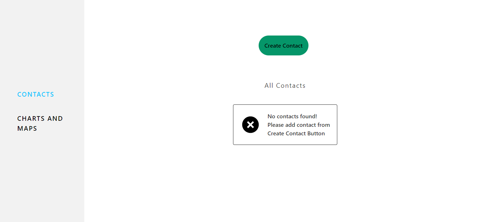
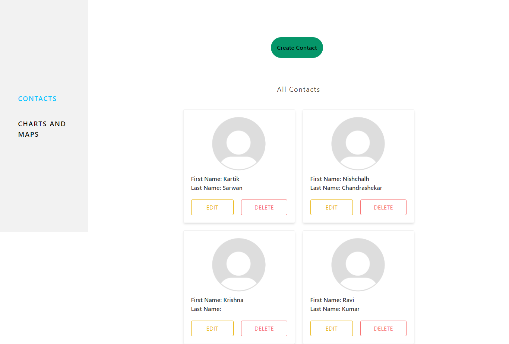

# Contact Management App

## Introduction

Creating a  **Contact Management App** built using ReactJS, JavaScript, TailwindCSS, React Router v6, and Redux. The app includes a dashboard with charts and maps that display COVID-19 data for different countries.

 

## 🔗 Important Links

> ## Checkout the Website [Web Application](https://contact-management-app-five.vercel.app/)

 

## Features

- **Objective Page Contact**

 Users can able to add new contacts using contact form.

 Users can able to see the list of all the added contacts.

 Users can able to edit and delete the contact details added.

- **Objective Page Charts and Maps:**

There a dashboard as well to see the flutuation in covid-19 cases. 

A line graph showing the cases fluctuations. It is categorised as recovered cases, Total cases and deaths. based on the category it is represented in the line graph. 

There is leaflet Map as well in the dashboard. A react leaflet map with markers that indicates the country name, total number of active, recovered cases and deaths in that particular country as a popup

## APIs Used:
- World wide data of cases: https://disease.sh/v3/covid-19/all
- Country Specific data of cases: https://disease.sh/v3/covid-19/countries
- Graph data for cases with date: https://disease.sh/v3/covid-19/historical/all?lastdays=all

## Getting Started With Project
- Fork the Project in your Repository.
- Clone this repository: git clone https://github.com/your-username/contact-management-app.git
- Install the dependencies: npm install
- Start the app: npm start
- The app should open in your default browser at http://localhost:3000/.

## Tools Used

 

## Library Used
- reactjs
- tailwind css
- react router v6
- react-query
- redux
- react-leaflet
- react-axios

- Version Control System: Git
- VCS Hosting: GitHub
- Programming / Scripting: TypeScript
- Front-End: ReactJS
- Integrated Development Environment: VSCode

## Screens

## Contact Page 

### Contact List

### Create Contact

### Edit Contact

### Delete Contact

### Leaflet Map

### Line Graph

